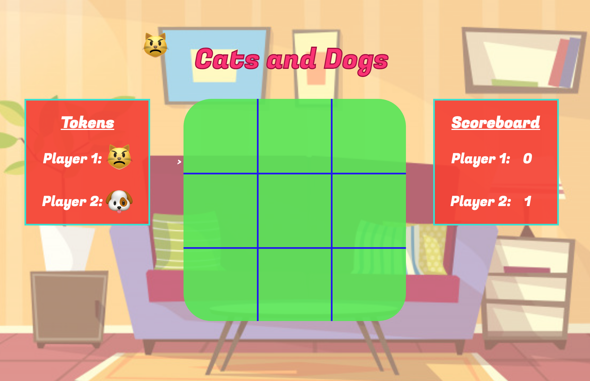

# Project0: Cats and Dogs (Tic Tac Toe)

Dogs and Cats is a simple tic-tac-toe game that follows the standard rules of play.

*Created by Faith Sylvia - General Assembly Class Project.*



## Demo
Click [here](https://faithsylvia1.github.io/Project0/) to test on the demo site.

## Technology Used

- HTML
- CSS
- JavaScript
- jQuery


## Rules

- The game is played on a 3 x 3 game board.
- Players select their spirit animal as their token during game play
- The first player to get 3 of their tokens in a row (either down, across, or diagonally) wins the game.
- If the board fills and there is no winner, it is a draw, or "Cat's Game," and the game is over.

## Key Features

1. Selection of token by button
1. Automatic assignment of token for other player based on Player 1 Selection
1. Current symbol follows cursor - serves as a mechanism of confirming whose turn it is
1. Buttons and individual cells change color on hover - cell hover has a short transition applied to the change of color
1. Animation on play again button
1. Ability to detect a draw as well as a win where the final empty cell calls the win - reference code for a draw is below. Note the second if statement tests if the game is over, which prevents this code from running if there is a winner but the board is also full (last click win):

```JavaScript
for ( let i = 1; i <= 9; i ++ ) {
  if ( $( `#${ i }` ).text() === '') {
    boardHasRemainingSpaces = true;
  }
}

if (boardHasRemainingSpaces === false && gameOver === false) {

  gameOver = true;
  $(' #cats-game' ).removeClass( 'invisible' );
  $( '#cats-game' ).addClass(' cats-game-over' );
  $( '#play-again' ).removeClass( 'invisible' );
  gameOver = true;
  $( '.play-again' ).on( 'click' , clearBoard );
  $( '#cursor-symbol' ).addClass( 'invisible' );
}

```
## Future Developments

- Vertically align center of side boards to center of main play board
- Make key if-else statement in checkWinner DRYer / simpler
- Allow input of player names instead of using "Player 1" and "Player 2"
- Use of images as tokens instead of text / emojis
